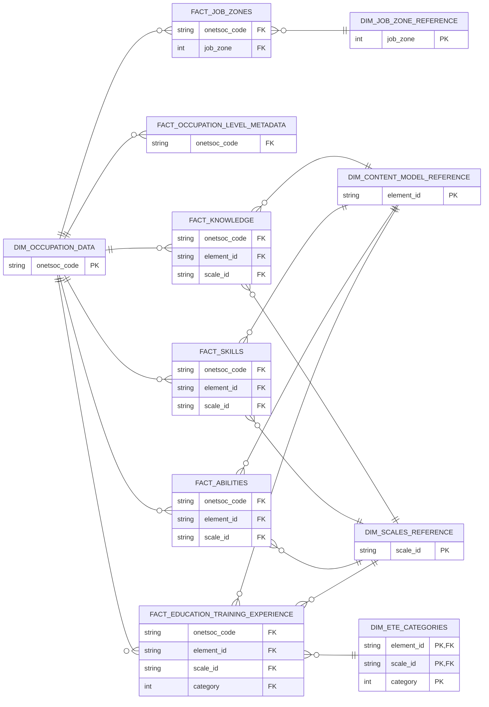
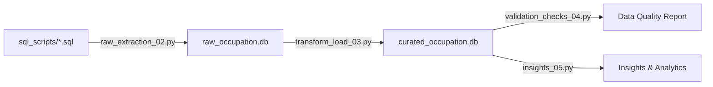

---

# 📊 Tulsa Workforce Data Warehouse – ETL Prototype

This project is a **lightweight, end‑to‑end ETL pipeline** and prototype data warehouse built for **Tulsa** to bring clarity and structure to messy workforce and wage data.  
It standardizes disparate job and wage datasets into a **clean, analytics‑ready SQLite database** that can power future dashboards and labor market analysis for multiple workforce programs across Tulsa.  

The workflow covers:
- **Schema design** for a snowflake warehouse model ([see snowflake schema](#-tulsa-datawarehouse-snowflake-schema))

- **Data extraction** from raw SQL scripts and source files  
- **Transformation & cleaning** to ensure consistency, handle nulls, and standardize formats  
- **Loading** curated tables into a centralized database  
- **Validation** to ensure data quality and reproducibility  
- **Example insights** demonstrating how the model supports workforce and labor market trend analysis  

This foundation enables the tech team to quickly build **scalable, maintainable analytics** that inform policy, training programs, and economic development initiatives in Tulsa.  

---

## 📂 Datasets Used

This project uses nine core datasets that together form a comprehensive foundation for analyzing Tulsa’s workforce and labor market trends. Each dataset plays a specific role in enabling standardized, reproducible, and insightful analytics.

| Dataset | Purpose in Project |
|---------|-------------------|
| **`job_zone_reference`** | Defines the five O*NET job zones, including required education, experience, and training. Used to classify occupations by preparation level for workforce planning. |
| **`occupation_data`** | Master list of occupations with codes, titles, and descriptions. Serves as the central dimension linking all other datasets. |
| **`occupation_level_metadata`** | Stores survey‑level or statistical metadata (e.g., response counts, percentages) for occupations. Adds context for interpreting workforce metrics. |
| **`abilities`** | Quantifies the abilities required for each occupation (e.g., problem sensitivity, manual dexterity). Supports skills gap analysis and training program design. |
| **`education_training_experience`** | Captures detailed requirements for education, training, and work experience by occupation. Enables alignment of training programs with job needs. |
| **`job_zones`** | Maps each occupation to its job zone classification. Facilitates filtering and aggregation by preparation level. |
| **`knowledge`** | Lists the knowledge areas (e.g., mathematics, customer service) important for each occupation, with importance/level ratings. Supports curriculum and program development. |
| **`skills`** | Details the skills (e.g., active listening, programming) required for each occupation, with measurable ratings. Used for identifying transferable skills and reskilling opportunities. |
| **`level_scale_anchors`** | Provides descriptive anchors for interpreting scale values in skills, knowledge, and abilities tables. Ensures consistent understanding of numeric ratings. |

### Why These Datasets Were Chosen
- **Comprehensive coverage** — Together, they describe *what* jobs exist, *what* they require, and *how* they are classified.
- **Standardized structure** — Based on O*NET relational design, ensuring consistency and compatibility with national labor data.
- **Analytical flexibility** — Supports multiple use cases: skills gap analysis, training alignment, job matching, and trend monitoring.
- **Future‑proofing** — Can be extended with wage data, employment counts, and program participation metrics without redesign.

---

## 🚀 Tulsa Datawarehouse Snowflake Schema

---

## 
## 📂 Project Structure

```
.
├── generic_functions_01.py
├── raw_extraction_02.py
├── transform_load_03.py
├── validation_checks_04.py
├── insights_05.py
├── sql_scripts/               # Source SQL Scripts
├── curated_occupation.db      # Final curated SQLite DB
├── raw_occupation.db          # Raw extracted SQLite DB
├── requirements.txt
└── README.md
```

---

## 📦 Requirements

This project uses the following core Python libraries from **PyPI**:  

| Library        | Purpose |
|----------------|---------|
| **pandas**     | Data manipulation and cleaning |
| **polars**     | High‑performance DataFrame operations for large datasets |
| **SQLAlchemy** | Database connection management and ORM |
| **sqlite-utils** | Lightweight SQLite database creation and management |

> The full list of dependencies (including version pins) is in `requirements.txt`.

---

## ⚙️ Installation

Clone the repository and install dependencies in a virtual environment:  

```bash
# 1. Clone the repo
git clone https://github.com/your-username/tulsa-workforce-warehouse.git
cd tulsa-workforce-warehouse

# 2. (Optional) Create and activate a virtual environment
python -m venv .venv
source .venv/bin/activate   # On Windows: .venv\Scripts\activate

# 3. Install dependencies
pip install -r requirements.txt
```

Once installed, you can run the ETL pipeline notebooks in sequence to build and validate the data warehouse.


---

## 🛠 Installing SQLite3 Locally

SQLite3 is a lightweight, serverless database engine. Many systems already include it by default, but if not, follow the steps below to install it.

### **Windows**
1. Go to the official SQLite download page: [https://www.sqlite.org/download.html](https://www.sqlite.org/download.html)  
2. Under **Precompiled Binaries for Windows**, download:
   - `sqlite-tools-win32-x86-<version>.zip` (contains `sqlite3.exe`)
3. Extract the ZIP file to a folder (e.g., `C:\sqlite`).
4. Add that folder to your **PATH** environment variable so you can run `sqlite3` from any terminal:
   - Search for “Edit the system environment variables” → **Environment Variables** → Edit **Path** → Add `C:\sqlite`.
5. Open a new Command Prompt and verify:
   ```bash
   sqlite3 --version
   ```


### **macOS**
SQLite3 is usually preinstalled. To check:
```bash
sqlite3 --version
```
If not installed or you want the latest version:
```bash
brew install sqlite
```
*(Requires [Homebrew](https://brew.sh/) to be installed.)*


### **Linux (Debian/Ubuntu)**
```bash
sudo apt update
sudo apt install sqlite3
sqlite3 --version
```

### **Linux (Fedora/CentOS/RHEL)**
```bash
sudo dnf install sqlite
sqlite3 --version
```


💡 **Tip:** If you’re using Python, you can also interact with SQLite via the built‑in `sqlite3` module — but having the CLI tool installed makes it easier to inspect and manage databases manually.


This project uses the following core Python libraries from **PyPI**:  

| Library        | Purpose |
|----------------|---------|
| **pandas**     | Data manipulation and cleaning |
| **polars**     | High‑performance DataFrame operations for large datasets |
| **SQLAlchemy** | Database connection management and ORM |
| **sqlite-utils** | Lightweight SQLite database creation and management |

> The full list of dependencies (including version pins) is in `requirements.txt`.


### 🗄 Create Required SQLite Databases

Before running the ETL pipeline, you need to create two **empty SQLite database files** in the project root:

- `raw_occupation.db` — stores the raw, extracted staging tables.  
- `curated_occupation.db` — stores the cleaned, transformed warehouse tables.

**Steps:**

1. Open a terminal in the project root directory.
2. Run the following commands:

```bash
# Create empty raw database
sqlite3 raw_occupation.db ".databases" ".exit"

# Create empty curated database
sqlite3 curated_occupation.db ".databases" ".exit"
```

Alternatively, you can create them in one go:

```bash
sqlite3 raw_occupation.db ".exit"
sqlite3 curated_occupation.db ".exit"
```

3. Verify the files exist:

```bash
ls -l *.db
```

You should see:

```
-rw-r--r--  1 user  group  0 Aug 31 15:48 curated_occupation.db
-rw-r--r--  1 user  group  0 Aug 31 15:48 raw_occupation.db
```


💡 **Tip:**  
If you skip this step, the ETL scripts will fail when trying to connect to the databases for the first time.

---

## 🚀 Pipeline Flow


---

## 📄 `generic_functions_01.py` — Generic Utilities for ETL & Analytics

This module contains **reusable helper functions** for:

- Reading SQL scripts from the `sql_scripts/` directory  
- Cleaning and standardizing **Polars DataFrames**  
- Managing **SQLite database connections**  
- Reading from and writing to SQL tables  

It is designed to be imported into other pipeline scripts (`raw_extraction_02.py`, `transform_load_03.py`, etc.) to keep ETL code **modular, maintainable, and DRY**.

---

### **1. File & SQL Script Utilities**
| Function | Purpose | Example |
|----------|---------|---------|
| `read_sql_script(filename)` | Reads a `.sql` file from `sql_scripts/` and returns its contents as a string. | `query = read_sql_script("init_schema.sql")` |

---

### **2. DataFrame Cleaning Utilities**
| Function | Purpose | Example |
|----------|---------|---------|
| `standardize_column_names(df)` | Converts all column names to `snake_case`. | `df = standardize_column_names(df)` |
| `trim_whitespace(df)` | Removes leading/trailing spaces from all string columns. | `df = trim_whitespace(df)` |
| `fill_nulls(df, cols, default)` | Replaces `null` values in given columns with a default value. | `df = fill_nulls(df, ["occupation"], "Unknown")` |
| `rename_column(df, old, new)` | Renames a column. Raises error if old name not found. | `df = rename_column(df, "occ_name", "occupation_name")` |
| `clean_func(df, null_check_cols, replace_null_value)` | Combines standardization, trimming, and optional null filling in one step. | `df = clean_func(df, ["occupation"], "Unknown")` |

---

### **3. Database Utilities**
| Function | Purpose | Example |
|----------|---------|---------|
| `db_connection(db_name)` | Opens a SQLite DB connection. | `conn = db_connection("raw_occupation.db")` |
| `commit_transaction(conn)` | Commits current transaction. | `commit_transaction(conn)` |
| `create_cursor(conn)` | Creates a DB cursor for executing SQL. | `cur = create_cursor(conn)` |
| `close_connection(conn)` | Closes the DB connection. | `close_connection(conn)` |

---

### **4. SQL Read/Write**
| Function | Purpose | Example |
|----------|---------|---------|
| `read_data_from_sql(conn, table_name)` | Reads all rows from a table into a Polars DataFrame. | `df = read_data_from_sql(conn, "occupations")` |
| `write_data_to_sql(engine, df, table_name)` | Writes a Polars DataFrame to a SQL table (`replace` by default). | `write_data_to_sql(conn, df, "curated_occupations")` |

---

### **5. Example Usage**
```python
from generic_functions_01 import (
    db_connection, read_sql_script, clean_func,
    read_data_from_sql, write_data_to_sql
)
import polars as pl

# Connect to DB
conn = db_connection("raw_occupation.db")

# Read SQL script
sql = read_sql_script("select_occupations.sql")

# Load data into Polars
df = read_data_from_sql(conn, "occupations")

# Clean data
df = clean_func(df, null_check_cols=["occupation"], replace_null_value="Unknown")

# Write cleaned data to curated DB
curated_conn = db_connection("curated_occupation.db")
write_data_to_sql(curated_conn, df, "curated_occupations")

# Close connections
close_connection(conn)
close_connection(curated_conn)
```

---

### **Key Notes**
- **Polars** is used instead of Pandas for faster, memory‑efficient processing.  
- All cleaning functions return **new DataFrames** (immutability).  
- SQL scripts are stored in `sql_scripts/` for maintainability.  
- Database functions are **SQLite‑specific** but can be adapted for other engines.  

---

## 📄 `raw_extraction_02.py` — Raw Data Extraction from SQL Scripts

This script is the **first operational step** in the ETL pipeline.  
It reads and executes a predefined set of SQL scripts from the `sql_scripts/` directory to populate the **raw SQLite database** (`raw_occupation.db`) with initial extracted data.

It relies on helper functions from [`generic_functions_01.py`](#-generic_functions_01py--generic-utilities-for-etl--analytics) for database connections, cursor creation, transaction commits, and SQL file reading.

---

### **1. Core Function**
| Function | Purpose | Example |
|----------|---------|---------|
| `execute_sql_scripts(db_name, sql_files)` | Opens a SQLite connection, reads each SQL file, executes it against the given database, commits the transaction, and closes the connection. | `execute_sql_scripts(raw_db, ["02_job_zone_reference.sql", "03_occupation_data.sql"])` |

---

### **2. How It Works**
1. **Connects** to the target SQLite database (`raw_db` from `generic_functions_01.py`).
2. **Iterates** over a list of SQL filenames.
3. **Reads** each SQL file from the `sql_scripts/` directory.
4. **Executes** the SQL script using `cursor.executescript()`.
5. **Commits** all changes after processing the list.
6. **Closes** the database connection.

---

### **3. Default SQL Execution Order**
When run as a standalone script (`python raw_extraction_02.py`), it executes the following SQL files in order:

1. `02_job_zone_reference.sql`  
2. `03_occupation_data.sql`  
3. `06_level_scale_anchors.sql`  
4. `07_occupation_level_metadata.sql`  
5. `11_abilities.sql`  
6. `12_education_training_experience.sql`  
7. `14_job_zones.sql`  
8. `15_knowledge.sql`  
9. `16_skills.sql`  

These scripts are expected to:
- Create and populate **raw staging tables**.
- Load reference data, occupation metadata, and skill/knowledge/ability datasets.

---

### **4. Example Usage**
```python
from raw_extraction_02 import execute_sql_scripts
from generic_functions_01 import raw_db

# Custom list of SQL scripts to run
sql_files = ["02_job_zone_reference.sql", "03_occupation_data.sql"]

# Execute scripts against the raw database
execute_sql_scripts(raw_db, sql_files)
```

---

### **5. Key Notes**
- **Order matters**: SQL scripts are executed sequentially; dependencies between scripts must be respected.
- **Error handling**: If a script fails, the error is printed but the loop continues with the next file.
- **Reusability**: You can import `execute_sql_scripts` into other scripts to run different SQL batches.
- **Integration point**: This script is typically followed by `transform_load_03.py` in the ETL pipeline.
---

## 📄 `transform_load_03.py` — Transform & Load to Curated Database

This script is the **second operational step** in the ETL pipeline.  
It reads raw tables from `raw_occupation.db`, applies **data cleaning and transformation rules**, and writes the processed data into the **curated SQLite database** (`curated_occupation.db`) in a **snowflake schema** format.

It uses helper functions from [`generic_functions_01.py`](#-generic_functions_01py--generic-utilities-for-etl--analytics) for database I/O, column renaming, and null handling.

---

### **1. Purpose**
- **Extract**: Read raw tables from the raw database.
- **Transform**: Standardize column names, trim whitespace, rename columns, and fill missing values with defaults.
- **Load**: Write cleaned tables into the curated database with **fact** and **dimension** table naming conventions.

---

### **2. Transformation Rules**
| Table | Transformations Applied | Output Table |
|-------|------------------------|--------------|
| `abilities` | Fill nulls in numeric columns (`standard_error`, `lower_ci_bound`) with `0`; `upper_ci_bound` with `100`; `not_relevant` with `"Undefined"`. | `fact_abilities` |
| `education_training_experience` | Rename `n` → `sample_size`; fill nulls in numeric columns with `0`; `upper_ci_bound` with `100`; `recommend_suppress` with `"Undefined"`. | `fact_education_training_experience` |
| `job_zone_reference` | Fill nulls in `name` with `"Undefined"`. | `dim_job_zone_reference` |
| `occupation_data` | No transformation. | `dim_occupation_data` |
| `occupation_level_metadata` | Rename `n` → `sample_size`; fill `response` nulls with `"No response"`; numeric nulls with `0`. | `dim_occupation_level_metadata` |
| `job_zones` | No transformation. | `fact_job_zones` |
| `knowledge` | Rename `n` → `sample_size`; fill numeric nulls with `0`; `upper_ci_bound` with `100`; categorical nulls with `"Undefined"`. | `fact_knowledge` |
| `skills` | Rename `n` → `sample_size`; fill numeric nulls with `0`; `upper_ci_bound` with `100`; categorical nulls with `"Undefined"`. | `fact_skills` |
| `level_scale_anchors` | Standard cleaning (trim, lowercase, snake_case). | `dim_level_scale_anchors` |

---

### **3. How It Works**
1. **Connect** to `raw_occupation.db` for reading.
2. **Create SQLAlchemy engine** for writing to `curated_occupation.db`.
3. For each source table:
   - Read into a **Polars DataFrame**.
   - Apply `clean_func()` for whitespace trimming, column standardization, and null filling.
   - Apply `rename_column()` where needed.
   - Write to curated DB using `write_data_to_sql()` with `replace` mode.
4. **Close** the raw DB connection.

---

### **4. Example Usage**
```python
# Run as standalone script
python transform_load_03.py

# Or import into another script
from transform_load_03 import *
```

---

### **5. Key Notes**
- **Fact vs Dimension Tables**:  
  - Fact tables store measurable values (e.g., `fact_abilities`, `fact_skills`).  
  - Dimension tables store descriptive attributes (e.g., `dim_job_zone_reference`).
- **Null Handling Defaults**:  
  - Numeric: `0` or `100` (for bounds)  
  - Text: `"Undefined"` or `"No response"`
- **Performance**: Uses **Polars** for fast in‑memory transformations and **SQLAlchemy** for flexible DB writes.
- **Integration Point**: This script follows `raw_extraction_02.py` and precedes `validation_checks_04.py` in the pipeline.

---

## 📄 `validation_checks_04.py` — Data Quality & Validation Checks

This script is the **third operational step** in the ETL pipeline.  
It runs a series of **SQL‑based data validation checks** against the curated database (`curated_occupation.db`) to ensure **referential integrity, value ranges, and data completeness** before generating insights.

It uses helper functions from [`generic_functions_01.py`](#-generic_functions_01py--generic-utilities-for-etl--analytics) for database connections and **Polars** for efficient query execution and result handling.

---

### **1. Purpose**
- **Verify** that all fact tables reference valid occupations in `dim_occupation_data`.
- **Check** that numeric values (e.g., job zones, confidence intervals) fall within expected ranges.
- **Detect** duplicate records in key fact tables.
- **Identify** missing skill/knowledge/ability records for occupations.

---

### **2. Validation Checks Performed**
| Check Name | Description | Example Issue Detected |
|------------|-------------|------------------------|
| Missing occupation references in `fact_skills` | Finds skill records with no matching occupation in `dim_occupation_data`. | Orphan skill records |
| Missing occupation references in `fact_abilities` | Finds ability records with no matching occupation. | Orphan ability records |
| Invalid `job_zone` values | Ensures job zones are between 1 and 5. | Job zone = 0 or 6 |
| Invalid CI bounds in `fact_knowledge` | Ensures `data_value` lies between `lower_ci_bound` and `upper_ci_bound`. | Lower bound > data value |
| Duplicate rows in `fact_skills` | Detects duplicate skill entries for the same occupation/element/scale. | Multiple identical skill rows |
| Occupations with no skills | Finds occupations missing any skill record. | Missing skill coverage |
| Occupations with no abilities | Finds occupations missing any ability record. | Missing ability coverage |

---

### **3. How It Works**
1. **Connects** to `curated_occupation.db`.
2. Defines a list of **named SQL queries** (`checks` list).
3. Loops through each check:
   - Executes the SQL query via `pl.read_database()`.
   - Stores the results with the check name.
4. **Prints** results:
   - ✅ “No issues found” if the query returns no rows.
   - Otherwise, prints the DataFrame of problematic records.

---

### **4. Example Usage**
```bash
# Run as standalone script
python validation_checks_04.py
```

Example output:
```
=== Missing occupation references in fact_skills ===
✅ No issues found

=== Invalid job_zone values ===
shape: (1, 3)
┌──────────────┬───────────┬────────────┐
│ onetsoc_code │ job_zone  │ other_col  │
├──────────────┼───────────┼────────────┤
│ 15-9999.00   │ 6         │ ...        │
└──────────────┴───────────┴────────────┘
```

---

### **5. Key Notes**
- **Polars** is used for fast query execution and DataFrame handling.
- Checks are modular — you can add/remove SQL queries in the `checks` list without changing the loop logic.
- This script should be run **after** `transform_load_03.py` to validate curated data before generating insights.
- Failures do not stop execution — all checks run regardless of earlier results.

---

## 📄 `insights_05.py` — Workforce Insights & Analytics Queries

This module contains **pre‑built SQL queries** that run against the **curated data warehouse** (`curated_occupation.db`) to generate actionable workforce insights.  
It is designed as the **final stage** of the ETL pipeline, demonstrating how the cleaned and standardized data can be used for **analysis, reporting, and dashboarding**.

---

### **1. Core Function**
| Function | Purpose | Example |
|----------|---------|---------|
| `run_query(conn, title, sql)` | Executes a SQL query against the given SQLite connection, prints a formatted heading, and displays the results as a **Polars DataFrame**. | `run_query(conn, "Top Skills", sql_top_skills)` |

---

### **2. Insights Generated**
When run as a standalone script (`python insights_05.py`), the module connects to the curated database and executes **four key analytical queries**:

1. **Top 10 Skills for High‑Preparation Jobs**  
   - Filters occupations in **Job Zones 4 and 5** (high preparation).  
   - Aggregates skill ratings and returns the highest‑scoring skills.

2. **Average Knowledge Score by Job Zone**  
   - Groups occupations by job zone.  
   - Calculates the average knowledge score for each zone.

3. **Occupations with Highest Ability Requirements**  
   - Finds occupations with the highest average ability scores.  
   - Useful for identifying jobs with the most demanding ability profiles.

4. **Occupations with Broadest Ability Requirements**  
   - Counts the number of distinct abilities required per occupation.  
   - Highlights jobs that require a wide range of abilities.

---

### **3. How It Works**
1. **Connects** to the curated SQLite database using `db_connection()` from `generic_functions_01.py`.
2. **Defines** SQL queries as multi‑line strings.
3. **Executes** each query with `run_query()`, which:
   - Prints a formatted title.
   - Runs the SQL against the database.
   - Loads results into a **Polars DataFrame** for fast display.
4. **Closes** the database connection after all queries are run.

---

### **4. Example Usage**
```python
from insights_05 import run_query
from generic_functions_01 import db_connection, curated_db

# Connect to curated DB
conn = db_connection(curated_db)

# Example: Run a custom query
sql = """
SELECT title, COUNT(*) AS skill_count
FROM fact_skills
JOIN dim_occupation_data USING (onetsoc_code)
GROUP BY title
ORDER BY skill_count DESC
LIMIT 5;
"""
run_query(conn, "Top 5 Occupations by Skill Count", sql)

conn.close()
```

---

### **5. Key Notes**
- **Dependencies**: Requires `generic_functions_01.py` for DB connection and `polars` for DataFrame handling.
- **Extensibility**: You can add new queries by defining a SQL string and calling `run_query()`.
- **Integration Point**: This script is typically run **after** `validation_checks_04.py` to ensure data quality before analysis.
- **Output**: Prints results directly to the console; can be adapted to export CSV/JSON for dashboards.

---

# 📊 Analysis Queries & Results

## 1. Top 10 Skills for High‑Preparation Jobs

**SQL:**
```sql
SELECT 
    dlsa.anchor_description AS skill_name,
    ROUND(AVG(fs.data_value), 2) AS avg_skill_score
FROM fact_skills fs
JOIN fact_job_zones fjz 
    ON fs.onetsoc_code = fjz.onetsoc_code
JOIN dim_job_zone_reference djzr 
    ON fjz.job_zone = djzr.job_zone
JOIN dim_level_scale_anchors dlsa 
    ON fs.element_id = dlsa.element_id
   AND fs.scale_id = dlsa.scale_id
WHERE djzr.job_zone >= 4
GROUP BY dlsa.anchor_description
ORDER BY avg_skill_score DESC
LIMIT 10;
```

**Output:**
```text
shape: (10, 2)
┌─────────────────────────────────┬─────────────────┐
│ skill_name                      ┆ avg_skill_score │
│ ---                             ┆ ---             │
│ str                             ┆ f64             │
╞═════════════════════════════════╪═════════════════╡
│ Understand an email from manag… ┆ 4.32            │
│ Read step-by-step instructions… ┆ 4.32            │
│ Read a scientific journal arti… ┆ 4.32            │
│ Write legal brief challenging … ┆ 4.16            │
│ Evaluate customer complaints a… ┆ 4.16            │
│ Determine whether a subordinat… ┆ 4.16            │
│ Write down a guest's order at … ┆ 4.03            │
│ Write an email to staff outlin… ┆ 4.03            │
│ Write a novel for publication   ┆ 4.03            │
│ Take a customer's order         ┆ 4.02            │
└─────────────────────────────────┴─────────────────┘
```

---

## 2. Average Knowledge Score by Job Zone

**SQL:**
```sql
SELECT 
    djzr.job_zone,
    djzr.name AS job_zone_name,
    ROUND(AVG(fk.data_value), 2) AS avg_knowledge_score
FROM fact_knowledge fk
JOIN fact_job_zones fjz 
    ON fk.onetsoc_code = fjz.onetsoc_code
JOIN dim_job_zone_reference djzr 
    ON fjz.job_zone = djzr.job_zone
GROUP BY djzr.job_zone, djzr.name
ORDER BY djzr.job_zone;
```

**Output:**
```text
shape: (4, 3)
┌──────────┬─────────────────────────────────┬─────────────────────┐
│ job_zone ┆ job_zone_name                   ┆ avg_knowledge_score │
│ ---      ┆ ---                             ┆ ---                 │
│ i64      ┆ str                             ┆ f64                 │
╞══════════╪═════════════════════════════════╪═════════════════════╡
│ 2        ┆ Job Zone Two: Some Preparation… ┆ 2.26                │
│ 3        ┆ Job Zone Three: Medium Prepara… ┆ 2.31                │
│ 4        ┆ Job Zone Four: Considerable Pr… ┆ 2.42                │
│ 5        ┆ Job Zone Five: Extensive Prepa… ┆ 2.45                │
└──────────┴─────────────────────────────────┴─────────────────────┘
```

---

## 3. Occupations with Highest Ability Requirements

**SQL:**
```sql
SELECT 
    dod.title AS occupation_title,
    dlsa.anchor_description AS ability_name,
    ROUND(AVG(fa.data_value), 2) AS avg_ability_score
FROM fact_abilities fa
JOIN dim_occupation_data dod 
    ON fa.onetsoc_code = dod.onetsoc_code
JOIN dim_level_scale_anchors dlsa 
    ON fa.element_id = dlsa.element_id
   AND fa.scale_id = dlsa.scale_id
GROUP BY dod.title, dlsa.anchor_description
ORDER BY avg_ability_score DESC
LIMIT 10;
```

**Output:**
```text
shape: (10, 3)
┌─────────────────────────────────┬─────────────────────────────────┬───────────────────┐
│ occupation_title                ┆ ability_name                    ┆ avg_ability_score │
│ ---                             ┆ ---                             ┆ ---               │
│ str                             ┆ str                             ┆ f64               │
╞═════════════════════════════════╪═════════════════════════════════╪═══════════════════╡
│ Education Administrators, Kind… ┆ Explain advanced principles of… ┆ 5.0               │
│ Education Administrators, Kind… ┆ Give instructions to a lost mo… ┆ 5.0               │
│ Education Administrators, Kind… ┆ Place an order at a restaurant… ┆ 5.0               │
│ Financial Quantitative Analyst… ┆ Decide how to calculate profit… ┆ 5.0               │
│ Financial Quantitative Analyst… ┆ Determine how much 20 oranges … ┆ 5.0               │
│ Financial Quantitative Analyst… ┆ Determine the mathematics requ… ┆ 5.0               │
│ Financial Quantitative Analyst… ┆ Understand a coach's oral inst… ┆ 5.0               │
│ Financial Quantitative Analyst… ┆ Understand a lecture on advanc… ┆ 5.0               │
│ Financial Quantitative Analyst… ┆ Understand a television commer… ┆ 5.0               │
│ Natural Sciences Managers       ┆ Decide what factors to conside… ┆ 5.0               │
└─────────────────────────────────┴─────────────────────────────────┴───────────────────┘
```

---

## 4. Occupations with Broadest Ability Requirements

**SQL:**
```sql
SELECT 
    dod.title AS occupation_title,
    COUNT(DISTINCT fa.element_id) AS distinct_abilities_count
FROM fact_abilities fa
JOIN dim_occupation_data dod 
    ON fa.onetsoc_code = dod.onetsoc_code
GROUP BY dod.title
ORDER BY distinct_abilities_count DESC
LIMIT 10;
```

**Output:**
```text
shape: (10, 2)
┌─────────────────────────────────┬──────────────────────────┐
│ occupation_title                ┆ distinct_abilities_count │
│ ---                             ┆ ---                      │
│ str                             ┆ i64                      │
╞═════════════════════════════════╪══════════════════════════╡
│ Wind Energy Operations Manager… ┆ 52                       │
│ Wind Energy Development Manage… ┆ 52                       │
│ Wholesale and Retail Buyers, E… ┆ 52                       │
│ Water Resource Specialists      ┆ 52                       │
│ Treasurers and Controllers      ┆ 52                       │
│ Transportation, Storage, and D… ┆ 52                       │
│ Training and Development Speci… ┆ 52                       │
│ Training and Development Manag… ┆ 52                       │
│ Telecommunications Engineering… ┆ 52                       │
│ Tax Preparers                   ┆ 52                       │
└─────────────────────────────────┴──────────────────────────┘
```

---

## 🙏 Credits & Acknowledgements

This project builds on the work of many organizations and open data initiatives.  
We gratefully acknowledge the following sources and contributors:

- **O\*NET Database** — Occupational data, job zone classifications, and detailed descriptors for skills, knowledge, and abilities are derived from the [O\*NET 28.1 Database](https://www.onetcenter.org/database.html), developed under the sponsorship of the **U.S. Department of Labor / Employment and Training Administration (USDOL/ETA)**.  
  ➤ *O\*NET® is a trademark of the U.S. Department of Labor, Employment and Training Administration. The use of O\*NET content does not imply endorsement by USDOL/ETA.*

- **Open‑source Python ecosystem** — This project relies on the contributions of the open‑source community, particularly the developers of:
  - [Polars](https://pola.rs/) for high‑performance DataFrame operations
  - [pandas](https://pandas.pydata.org/) for data manipulation
  - [SQLAlchemy](https://www.sqlalchemy.org/) for database connectivity
  - [sqlite-utils](https://sqlite-utils.datasette.io/) for lightweight SQLite management

- **Community & Documentation** — Thanks to the maintainers of public documentation, tutorials, and schema references that informed the ETL design and validation approach.

---
